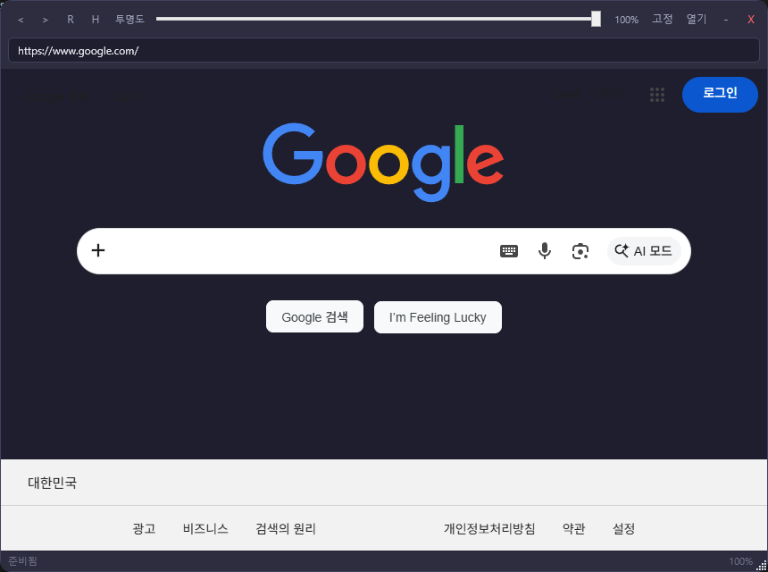
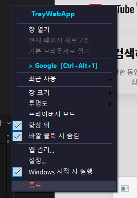
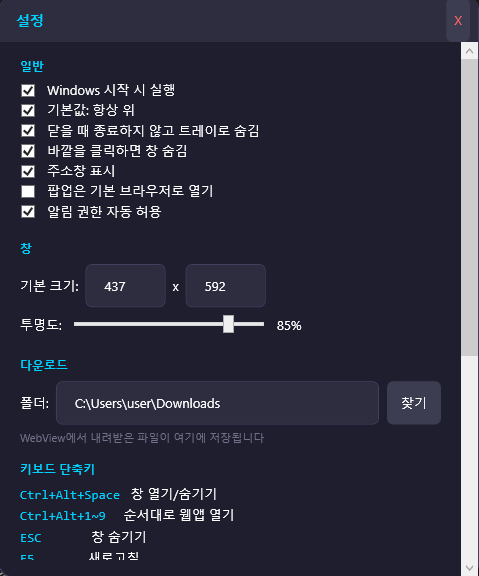

# TrayWebApp

TrayWebApp은 Windows 시스템 트레이에서 실행되는 미니 브라우저 앱입니다. macOS의 MenubarX처럼 자주 쓰는 웹앱을 작은 창으로 빠르게 열고, 투명도/항상 위/창 크기/단축키를 조정해서 사용할 수 있습니다.

## 미리보기






## 주요 기능

- 시스템 트레이 기반 실행
- WebView2 기반 웹앱 브라우징
- 웹앱 추가, 수정, 삭제, 순서 변경
- 앱별 URL, 창 크기, User-Agent, 줌 설정
- 항상 위 고정
- 창 투명도 조절
- 주소창 표시/숨김
- 최근 사용 앱 표시
- 전역 단축키
- 다운로드 폴더 설정
- 카메라, 마이크, 위치 등 웹 권한 요청 처리
- Windows 시작 시 자동 실행 옵션
- 포터블 exe, zip, 설치 파일 빌드 지원

## 사용 방법

앱을 실행하면 오른쪽 아래 Windows 시스템 트레이에 아이콘이 표시됩니다.

- 트레이 아이콘 왼쪽 클릭: 창 열기/숨기기
- 트레이 아이콘 오른쪽 클릭: 앱 목록, 설정, 창 크기, 투명도, 종료 메뉴
- `Ctrl + Alt + Space`: 창 열기/숨기기
- `Ctrl + Alt + 1~9`: 등록된 웹앱 빠른 실행
- `Esc`: 창 숨기기
- `Ctrl + L`: 주소창 포커스
- `F5`: 새로고침
- `F12`: 개발자 도구 열기

## 실행 요구사항

- Windows 10/11
- Microsoft Edge WebView2 Runtime
- 개발/빌드 시 .NET 8 SDK
- 설치 파일 생성 시 Inno Setup 6

대부분의 Windows 10/11 환경에는 WebView2 Runtime이 이미 설치되어 있습니다. 없는 PC에서는 Microsoft Edge WebView2 Runtime을 별도로 설치해야 합니다.

## 개발 환경에서 실행

```powershell
git clone https://github.com/chief7852/TrayWebApp.git
cd TrayWebApp
dotnet restore
dotnet run --project src\TrayWebApp.App
```

## 배포 파일 만들기

릴리스 빌드는 다음 명령으로 생성합니다.

```powershell
cd TrayWebApp
.\build-release.ps1
```

생성 위치:

- 단일 실행 파일: `publish\win-x64-final\TrayWebApp.exe`
- 포터블 zip: `publish\TrayWebApp-1.0.0-win-x64-*.zip`
- 설치 파일: `publish\installer\TrayWebApp-Setup-1.0.0.exe`

Inno Setup 6이 설치되어 있지 않으면 설치 파일은 생성되지 않고, exe와 zip까지만 생성됩니다.

## 친구에게 배포하는 방법

가장 쉬운 방식은 설치 파일을 전달하는 것입니다.

```text
publish\installer\TrayWebApp-Setup-1.0.0.exe
```

친구에게는 다음처럼 안내하면 됩니다.

```text
1. TrayWebApp-Setup-1.0.0.exe를 실행합니다.
2. Windows SmartScreen 경고가 나오면 "추가 정보" > "실행"을 누릅니다.
3. 설치 마법사에서 설치를 진행합니다.
4. 설치 후 시스템 트레이의 TrayWebApp 아이콘을 클릭해서 사용합니다.
```

설치 없이 사용하게 하려면 포터블 zip을 전달하면 됩니다.

```text
1. zip 파일 압축을 풉니다.
2. TrayWebApp.exe를 실행합니다.
```

## 앱 데이터 저장 위치

사용자 설정, 등록한 웹앱, WebView2 세션 데이터는 다음 경로에 저장됩니다.

```text
%LOCALAPPDATA%\TrayWebApp
```

앱을 삭제해도 이 폴더가 남아 있으면 설정과 로그인 세션이 유지될 수 있습니다.

## 배포 시 주의사항

- 코드 서명 인증서가 없으면 Windows SmartScreen 경고가 표시될 수 있습니다.
- 항상 위 기능은 일반 데스크톱 앱 위에서 동작합니다. 관리자 권한 앱, 보안 데스크톱, 독점 전체화면 앱 위까지는 Windows 정책상 보장되지 않습니다.
- GitHub 저장소에는 빌드 산출물인 `publish/`, `bin/`, `obj/`를 올리지 않습니다. 배포 파일은 로컬에서 `build-release.ps1`로 생성합니다.

## 라이선스

MIT License
